# Wonkeen Gophers

This repository contains some of the artwork created by Wonkeen.

Wonkeen is a new clothing brand by and for engineers. When we started this project some months ago, we decided to start creating unique products for developers and we 
believe that gophers are the perfect first approach for that.

We are a group of software engineers with strong, free, and open source values. For that reason, the content that you will find here is under an Attribution Non-Commercial ShareAlike Creative Commons license. 

If you like the idea and you want us to create more content you can support us at [wonkeen.com](https://wonkeen.com)

You can also follow us on instagram @wonkeen.shop

## Credits

[Renee French](http://reneefrench.blogspot.com/): For creating the first gopher ever

[Rob Pike](http://herpolhode.com/rob/): For co-creating the Go programming language

[Ashley McNamara](https://medium.com/@ashleymcnamara): For years, Ashley has been an active member of the Go Community. She also created a lot of gopher related content that you can find [here](https://github.com/ashleymcnamara/gophers)

## Preview

[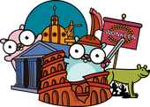](gophers-in-rome.png)
[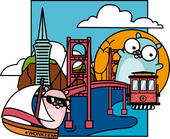](gophers-in-san-francisco.png)
[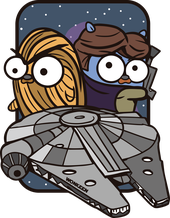](space-fighter-5.png)
[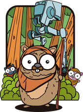](space-fighter-4.png)
[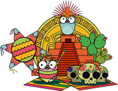](gophers-in-mexico.png)
[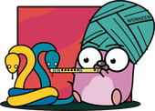](python-charmer.png)
[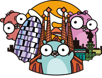](gophers-in-barcelona.png)
[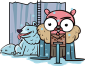](gopher-snow.png)
[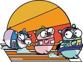](gophers-language-race.png)
[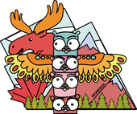](gophers-in-canada.png)
[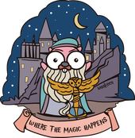](magic-gopher-old.png)
[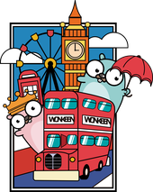](gophers-in-london.png)
[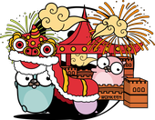](gophers-in-china.png)
[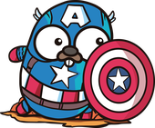](superhero-capitan-gopher.png)
[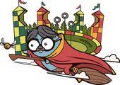](magic-gopher-2.png)
[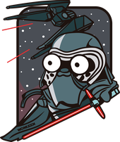](space-fighter-6.png)
[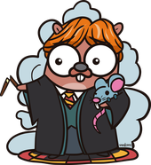](magic-gopher.png)
[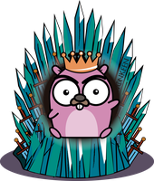](gopher-throne.png)
[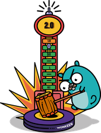](gopher-Go-2.0.png)
[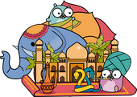](gophers-in-india.png)
[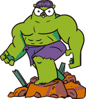](superhero-green-gopher.png)
[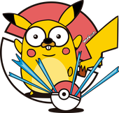](gopher-ball.png)
[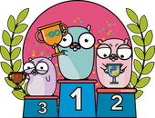](gophers-language-podium.png)
[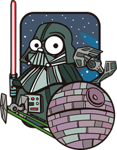](space-fighter-3.png)
[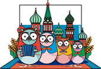](gophers-in-russia.png)
[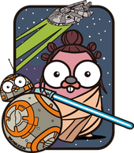](space-fighter.png)

## License

This work is licensed under a [Creative Commons Attribution-NonCommercial-ShareAlike 4.0 International License](http://creativecommons.org/licenses/by-nc-sa/4.0/).

Feel free to contact us if this license does not fit your needs or you have any doubt about how to use this content.
